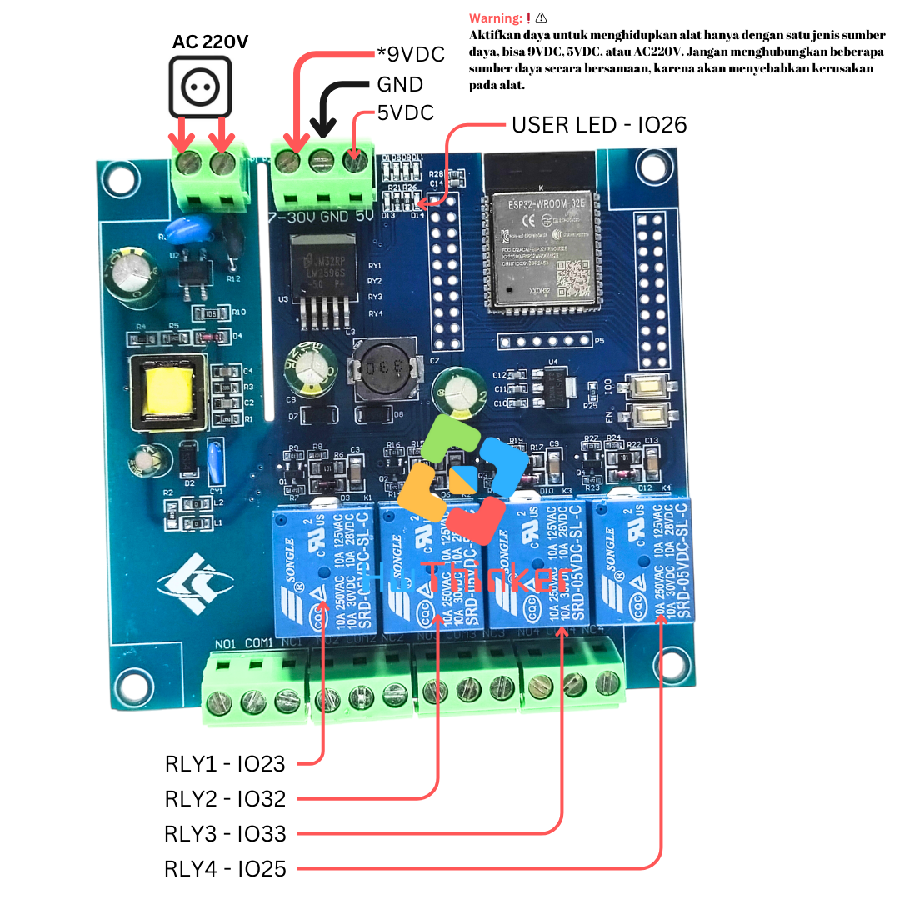
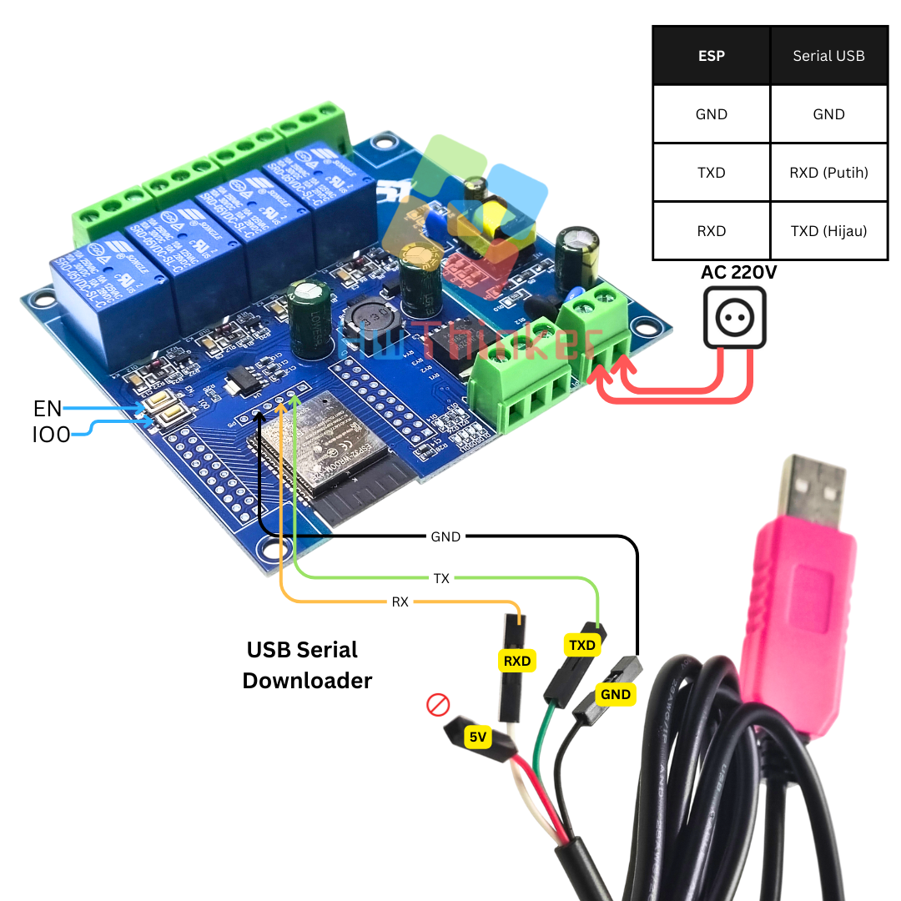
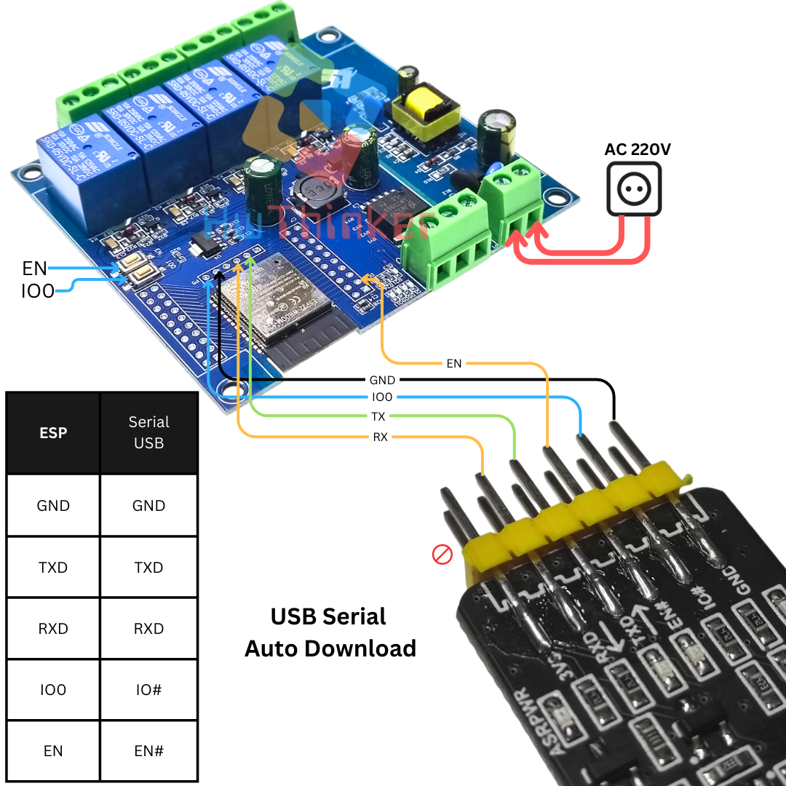

# Modul ESP32 Relay 4 Channel  AC



## Cara download dengan Serial USB biasa

- Pasang serial USB TTL dengan ketentuan: 
   - TX -> RX USB Serial (Kabel Putih)
   - RX -> TX USB Serial (Kabel Hijau)
   - GND -> GND USB Serial (Kabel Hitam)
- Pastikan supply AC220V  dihubungkan 2 pin Terminal block(pin N dan L)
- Tekan dan tahan tombol IO0 
- klik (tekan dan lepas) tombol EN dan pastikan  tombol IO0 masih di tekan
- Lepas tombol IO0
- Download program dan tunggu sampai selesai
- klik tombol EN untuk run-program (langkah ini penting agar firmware baru dijalankan)
- ulang langkah awal bila melakukan download ulang lagi


## Cara download dengan Serial USB auto Download

- Pasang serial USB TTL dengan ketentuan:
    - RX -> RX USB Serial  
    - TX -> TX USB Serial 
    - GND -> GND USB Serial  
    - IO0 -> IO# USB Serial 
    - EN -> EN# USB Serial
- Pastikan supply AC220V  dihubungkan 2 pin Terminal block(pin N dan L)
- Download program dan tunggu sampai selesai

Warning:❗⚠️
Aktifkan daya untuk menghidupkan alat hanya dengan satu jenis sumber daya, bisa 9VDC, 5VDC, atau AC220V. Jangan menghubungkan beberapa sumber daya secara bersamaan, karena akan menyebabkan kerusakan pada alat.


# Cara install plugin Arduino IDE

### Langkah 1: Buka Arduino IDE

1. Buka aplikasi Arduino IDE di komputer Anda.

### Langkah 2: Tambahkan URL Board Manager untuk ESP32

1. Di Arduino IDE, buka **File** > **Preferences**.

2. Pada bagian 

   Additional Boards Manager URLs

   , tambahkan URL berikut:

   ```
   https://raw.githubusercontent.com/espressif/arduino-esp32/gh-pages/package_esp32_index.json
   ```

3. Jika sebelumnya Anda sudah memiliki URL lain di sana, pisahkan URL ini dengan tanda koma atau baris baru.

### Langkah 3: Buka Boards Manager

1. Buka **Tools** > **Board** > **Boards Manager**.
2. Di kotak pencarian, ketik **ESP32**.

### Langkah 4: Instal Board ESP32

1. Temukan **ESP32 by Espressif Systems** di daftar, kemudian klik **Install**.
2. Tunggu hingga proses instalasi selesai.

### Langkah 5: Pilih Board ESP32

1. Setelah instalasi selesai, Anda dapat memilih board ESP32.
2. Buka **Tools** > **Board**, dan gulir ke bawah untuk menemukan berbagai jenis board ESP32 yang telah diinstal. Pilih board yang sesuai, misalnya **ESP32 Dev Module** jika Anda menggunakan board DevKit V1.

### Langkah 6: Pilih Port

1. Sambungkan board ESP32 ke komputer Anda menggunakan kabel USB.
2. Di **Tools** > **Port**, pilih port yang sesuai dengan ESP32 Anda.